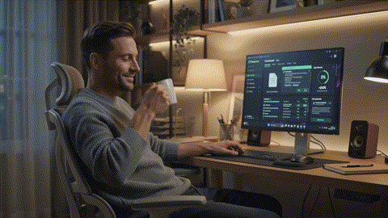
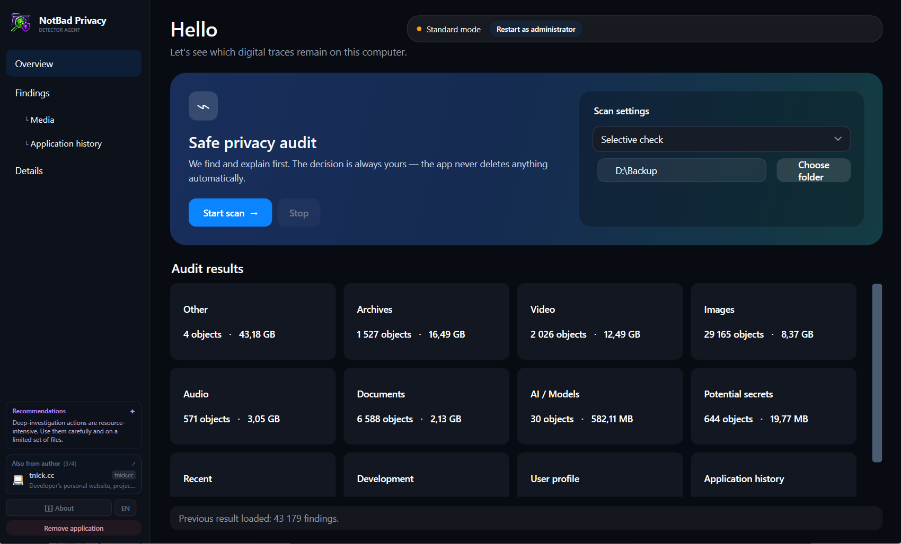
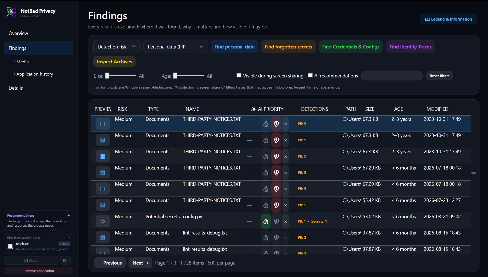
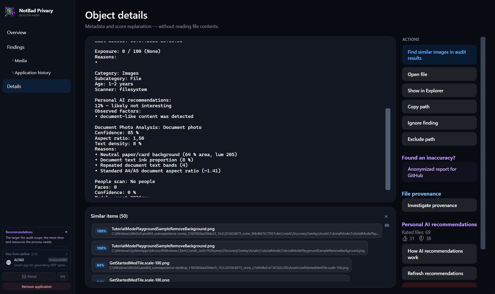
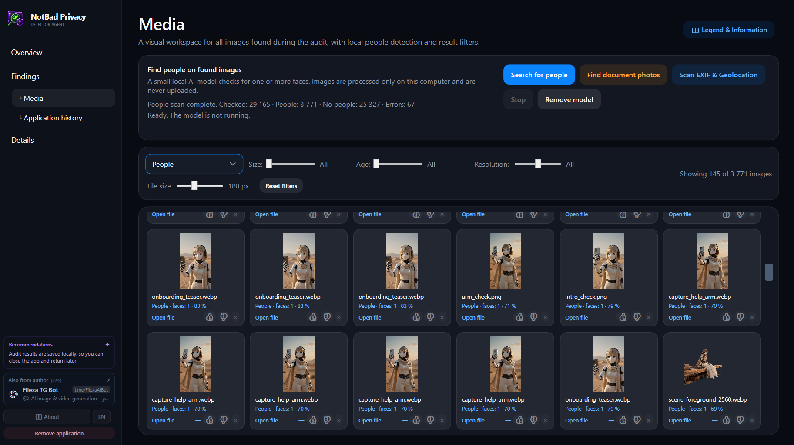
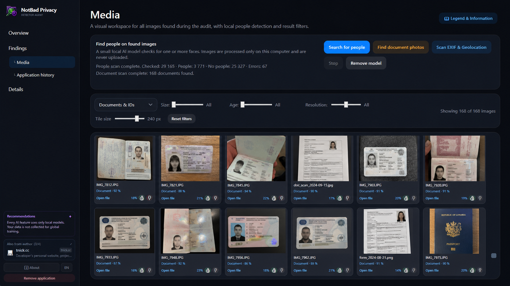
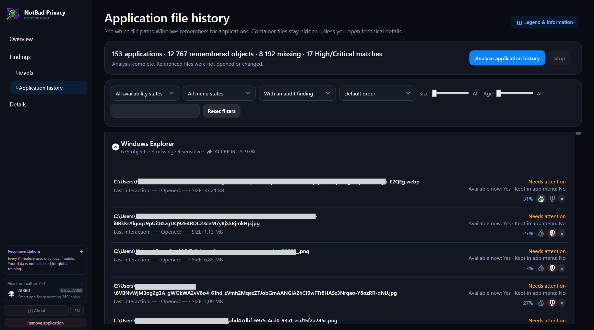

# NotBad Privacy Detector Agent

[Русская версия](README.ru.md)

> **Find what you forgot — before someone else does.**

NotBad Privacy Detector Agent is a portable, local-first privacy scanner for Windows. It turns forgotten files, personal data, secrets, application traces and revealing metadata into a clear map of what deserves your attention — without sending your digital life to the cloud.

## Your PC remembers more than you do

Old documents. API keys in abandoned configs. Photos with GPS. Copies buried in archives. Application histories that still point to files you thought were gone.

NotBad Privacy Detector Agent brings those traces together, explains the risk and helps you decide what matters. It is an auditor and detector — you stay in control of every action.

## Highlights

- **Digital archaeology in one place.** Discover personal data, credentials, forgotten application traces, sensitive archives, media metadata and duplicates across the PC.
- **Risk you can understand.** Findings come with evidence and context, so a scary score is never the whole explanation.
- **Discover where it came from.** Investigate a selected file's likely origin and connections to local software without turning the audit into guesswork.
- **See what applications remember.** Explore Windows application history as meaningful apps and remembered objects instead of a wall of cryptic system containers.
- **Report misses without exposing yourself.** Preview a privacy-safe, anonymized incorrect-detection report before choosing whether to open GitHub.
- **Truly local and portable.** No account, telemetry, cloud inference, installer, background service or autostart entry.

### See it in action

  

<em>Audit overview: choose the scan scope and see the results grouped by privacy-relevant category.</em>

  

<em>Findings: review personal data and potential secrets with risk, evidence, filters and local AI priority.</em>

  

<em>Object details: inspect the audit evidence, investigate a file's provenance and find similar copies without opening its contents.</em>

  

<em>People search: detect faces in found images using a model that runs locally on your computer.</em>

  

<em>Document scan: surface document photos and identity-document traces for deliberate review.</em>

  

<em>Application history: inspect file paths remembered by Windows applications, including missing and sensitive matches.</em>

## ✨ AI Priority — tuned by you

Your privacy priorities are personal. Rate findings with 👍 or 👎, and an optional model trained locally on your feedback learns what is more likely to deserve **your** attention.

**✨ AI Priority** brings those recommendations to the top across findings, media and remembered application objects. Your ratings and model stay on your PC, and the recommendation remains a separate personal signal — it never replaces the product's evidence-based risk scores.

[See how the personal recommendation model works](docs/PERSONAL_MODEL_USER_DESCRIPTION.md).

## What it can uncover

- personal identifiers, contacts and sensitive document traces;
- API tokens, private keys, connection strings and forgotten credentials;
- application profiles, sessions, caches, histories and orphaned data;
- GPS/EXIF metadata, camera details, document photos and people indicators;
- sensitive files hidden inside archives and similar copies spread across folders;
- Windows Recent and application-history traces that can resurface during everyday work or screen sharing.

## Three steps to clarity

1. Run a **Quick**, **Full** or **Custom** audit.
2. Review the most exposed or personally relevant findings.
3. Open Details when you need evidence, provenance or a deliberate next action.

The app does not decide what you should delete. File actions are explicit and separately confirmed.

> [!WARNING]
> **AS IS — USE AT YOUR OWN RISK.** The software is provided without warranties. The developer and contributors are not liable for data loss, data corruption, system damage, financial loss or any other direct or indirect consequences arising from use or inability to use the software. You are responsible for your decisions, permissions and backups. Read the full [Disclaimer](DISCLAIMER.md) and [MIT License](LICENSE) before use.

## Private by design

- normal audits and personal recommendations run locally;
- file paths, findings, ratings and model data are not uploaded;
- SQLite stores audit metadata, not arbitrary file contents;
- junctions and reparse points are not followed by default;
- the app does not change Registry, Defender, Windows Search or system services;
- optional network actions, such as downloading the people-detection model or opening a browser link, require an explicit user action.

See the full [Privacy Policy](PRIVACY.md), [Security Policy](SECURITY.md) and [Disclaimer](DISCLAIMER.md).

## Download and run

Download the latest portable `NotBadPrivacyDetectorAgent.exe` from Releases, place it in a folder you control and run it. No installer is required. Standard mode is enough for user-accessible locations; restart with administrator rights only when you explicitly want to inspect protected system areas.

## Documentation

README is the product overview. Implementation details, component contracts and development notes live in the linked engineering documents:

[Project map](docs/PROJECT_MAP.md) · [Architecture](docs/ARCHITECTURE.md) · [Testing](docs/TESTING.md) · [Building from source](docs/BUILDING.md) · [Personal recommendation model](docs/PERSONAL_MODEL_USER_DESCRIPTION.md)

NotBad Privacy Detector Agent is distributed under the [MIT License](LICENSE). Third-party components and their licenses are listed in [Third-Party Notices](THIRD_PARTY_NOTICES.md).
